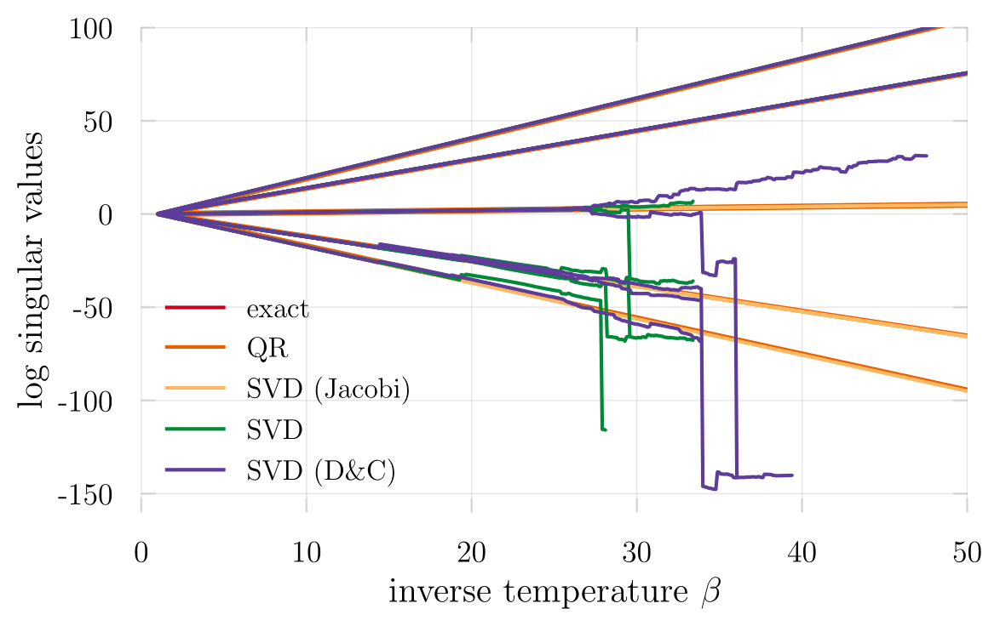

[![travis][travis-img]](https://travis-ci.org/crstnbr/StableDQMC.jl)
[![appveyor][appveyor-img]](https://ci.appveyor.com/project/crstnbr/stabledqmc-jl/branch/master)
[![codecov][codecov-img]](http://codecov.io/github/crstnbr/StableDQMC.jl?branch=master)
[](https://slackinvite.julialang.org/)
[](https://opensource.org/licenses/MIT)
<!-- [![coveralls][coveralls-img]](https://coveralls.io/github/crstnbr/BinningAnalysis.jl?branch=master) !-->

[travis-img]: https://img.shields.io/travis/crstnbr/StableDQMC.jl/master.svg?label=linux
[appveyor-img]: https://img.shields.io/appveyor/ci/crstnbr/stabledqmc-jl/master.svg?label=windows
[codecov-img]: https://img.shields.io/codecov/c/github/crstnbr/StableDQMC.jl/master.svg?label=codecov
[coveralls-img]: https://img.shields.io/coveralls/github/crstnbr/StableDQMC.jl/master.svg?label=coverage

This is a small collection of linear algebra routines for performing inversions as they appear in the calculation of Green's functions in [determinant Quantum Monte Carlo](https://en.wikipedia.org/wiki/Quantum_Monte_Carlo) in a numerically stabilized manner.

For more details, check out the (unfinished!) accompanyig [paper](https://github.com/crstnbr/StableDQMC.jl/raw/master/paper/stabilization.pdf), in which we describe and benchmark a few specific algorithms. The plots in the paper have been generated with the notebooks in [the notebook directory](https://github.com/crstnbr/StableDQMC.jl/tree/master/notebooks) of this repository.

Feel free to give feedback, open issues, or contribute useful algorithms yourself! 🙂

### Installation

```
] add https://github.com/RalphAS/JacobiSVD.jl
] add https://github.com/crstnbr/StableDQMC.jl
```

### Why should I care?

<table>
  <tr>
    <td></td>
    <td></td>
  </tr>
</table>

### Decompositions

Based on the QR decomposition, we introduce a `UDT` factorization, where `U` is unitary, `D` is real-valued and diagonal, and `T` is upper-triangular. To decompose a given matrix `M` the `udt` function is exported.

```julia
julia> M = rand(10,10);

julia> udt(M)
UDT{Float64,Float64,Array{Float64,2}}([-0.246588 0.12668 … 0.582208 0.206435; -0.373953 -0.300804 … 0.152994 0.0523203; … ; -0.214686 -0.403362 … -0.124248 -0.390502; -0.40412 -0.147009 … 0.1839 0.197964], [2.15087, 1.47129, 1.14085, 0.911765, 0.850504, 0.620149, 0.545588, 0.412213, 0.305983, 0.148787], [-0.597235 -1.0 … -0.678767 -0.59054; -0.385741 0.0 … -1.0 -0.361263; … ; 0.0 0.0 … 0.0 0.0; 0.0 0.0 … 0.0 0.0])
```

The package provides convenient access to several LAPACK algorithms for calculating singular value decompositions (SVDs):

* `gesdd`, `gesdd!`: Divide and conquer
* `gesvd`, `gesvd!`: Regular
* `gesvj`, `gesvj!`: Jacobi

Furthermore, you can access GenericSVD.jl's type-generic implementation through `genericsvd`, `genericsvd!`.

### Inversions

In DQMC, we commonly perform inversions like `G = [1 + B]^-1` to obtain the equal-times Green's function and `G = [A + B]^-1` for the time-displaced pendant. The following methods are exported to facilitate these tasks.

* `inv_one_plus`, `inv_one_plus!`
* `inv_sum`, `inv_sum!`

When function names are suffixed with `_loh`, i.e. `inv_one_plus_loh`, a more sophisticated method is used for numerical stabilization (see the paper linked above for more details).

### Short example

```julia
julia> using LinearAlgebra

julia> B = rand(ComplexF64, 100,100);

julia> Bfact = udt(B);

julia> G = inv_one_plus_loh(Bfact);
```

Since the matrix `B` is well-conditioned in this case, we have

```julia
julia> G ≈ inv(I + B)
true
```
